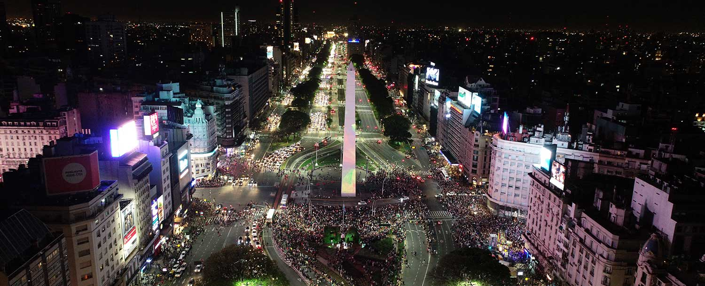
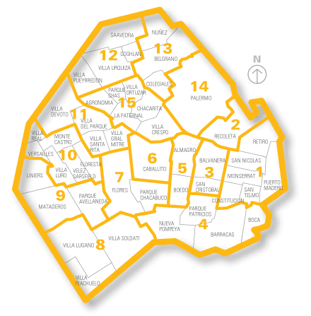

# PI Analista de datos: Siniestros Viales

# Guia de contenido
- [Explicacion de Datos](#datos)
- [Analisis Exploratorio de Datos: EDA](#eda)
- [Analisis y conclusiones de los KPIs Utilizados](#kpis)
- [Conclusiones Finales sobre los datos](#conclusiones-finales)
- [Tecnologias Utilizadas en el proyecto](#tecnologias-utilizadas)
- [Datasets utilizados](#datasets)
- [Contacto](#contacto)

**Descripción:**
En este proyecto, el Observatorio de Movilidad y Seguridad Vial (OMSV) nos encargó realizar un exhaustivo análisis sobre los siniestros viales que tienen lugar en **Capital Federal (CABA), Buenos Aires, Argentina**, durante el período comprendido entre los años 2016 y 2021. El objetivo principal es comprender mejor la ubicación y características de los accidentes, así como identificar los tipos de vehículos implicados tanto como víctimas como causantes. También buscamos determinar en qué fechas son más frecuentes estos incidentes y cuáles son los géneros más afectados. A través de este análisis, se pretende descubrir patrones subyacentes y proporcionar recomendaciones para reducir la incidencia de accidentes viales.

Finalmente, se presentará una explicación detallada de los resultados obtenidos en el Análisis Exploratorio de Datos (EDA), los Indicadores Clave de Rendimiento (KPIs) y las conclusiones finales. Además, se proporcionará información sobre las tecnologías utilizadas en el proceso de análisis. Se incluirán enlaces a los conjuntos de datos utilizados para que otros investigadores o entidades interesadas puedan acceder a ellos y replicar o ampliar este estudio.

# Datos

Para llevar a cabo este análisis, utilizaremos dos conjuntos de datos de acceso público proporcionados por la página de Buenos Aires Datasets, denominados Hechos y Víctimas.

**Dataset Hechos:** Este conjunto de datos contiene principalmente la identificación del hecho, que está relacionada con el conjunto de datos de Víctimas. Además, incluye información sobre la fecha y hora del accidente, la ubicación del hecho, la categoría de la calle donde ocurrió, las coordenadas de latitud y longitud, la comuna correspondiente, la víctima del hecho, el acusado del hecho y los participantes involucrados. Estos últimos pueden ser tanto víctimas como acusados, o puede haber múltiples participantes en un mismo incidente.

**Dataset Víctimas:** Este conjunto de datos contiene la identificación del hecho, que es esencial para establecer la relación con los datos del conjunto de Hechos. También incluye información sobre la fecha, la edad de la persona accidentada, el sexo, el tipo de vehículo en el que se encontraba, el rol que desempeñaba en el vehículo en el momento del incidente y la fecha del fallecimiento en caso de que haya ocurrido.

# EDA

### Análisis y Limpieza de Datos

En primer lugar, examinamos la estructura de los datasets para comprender su contenido y organización. A partir de este análisis inicial, identificamos las columnas que no necesitaremos utilizar, ya que hay otras que contienen menos valores nulos y proporcionan información más útil.

### Limpieza y Normalización de Datos

Durante el proceso de limpieza y normalización de los datos, observamos que una cantidad significativa de registros en el dataset "hechos" tiene tanto a las víctimas como a los acusados etiquetados como SD (Sin Dato). Decidimos eliminar estos registros donde ambos participantes son SD, ya que no nos proporcionan información valiosa sobre los accidentes. Además, detectamos que algunas entradas carecen de coordenadas y direcciones precisas de los hechos, lo cual también necesitamos abordar.

En otros aspectos del dataset "hechos", encontramos valores SD y nulos en las columnas de fecha de fallecimiento, edad y sexo. En estos casos, optamos por reemplazar los valores nulos con 0 o mantenerlos como SD si estos valores aún son relevantes para nuestro análisis.

Esta limpieza y normalización de datos son cruciales para asegurar que el análisis posterior sea preciso y significativo, eliminando información irrelevante y gestionando los datos faltantes de manera adecuada.

### Gráficas para Visualizar los Datos

* **Accidentes Anuales:** 
  Las gráficas de visualización nos muestran que los años con mayor número de accidentes fueron 2016, 2017 y 2018. En 2019, hubo una reducción de aproximadamente un 30% en los accidentes, y en 2020, una disminución adicional de un 10%, lo cual puede atribuirse a la pandemia de COVID-19. En 2021, el número de accidentes volvió a niveles similares a los de 2019.

* **Víctimas y Acusados por Año:**
  Entre las víctimas más frecuentes de accidentes se encuentran **motociclistas y peatones**. Los motociclistas tuvieron más de 40 casos anuales, excepto en 2020. Los peatones registraron entre 50 y 60 accidentes anuales entre 2016 y 2018, disminuyendo a menos de 40 a partir de 2019. Los principales acusados de causar accidentes son los **autos, pasajeros que suben o bajan de un vehículo y camiones de carga**. Los autos superaron los 30 casos anuales excepto en 2020. Los pasajeros superaron los 30 casos anuales hasta 2018, y luego de 2019, esta cifra se redujo a menos de 20 casos. Los camiones de carga superaron los 30 casos solo en 2019.

* **Accidentes Mensuales:**
  Considerando todos los años, los meses con más de 40 casos de accidentes son noviembre, diciembre y enero. Mayo, junio y agosto también registran cerca de 40 casos. Las altas tasas de accidentes en noviembre, diciembre y enero se deben a las festividades, donde el consumo de alcohol y la conducción imprudente son más comunes. Mayo, junio y agosto, aunque no son meses festivos, incluyen las vacaciones de invierno, lo que incrementa los viajes y, en consecuencia, los accidentes.

* **Categorías de Calles con Más Accidentes:**
  Las **avenidas** son las vías con mayor número de accidentes, registrando más de 30 casos por año. Las calles, en comparación, tienen un promedio de 10 accidentes anuales.

* **Géneros Accidentados:**
  El género más afectado por los accidentes es el **masculino**, con más de 60 casos anuales. El **femenino** tiene un promedio de 30 casos anuales. Los hombres sufrieron más accidentes en motocicleta (aproximadamente 260 casos), como peatones (150 casos) y en auto (70 casos). Las mujeres tuvieron alrededor de 100 accidentes como peatones y 40 en motocicleta.

* **Horas con Más Accidentes:**
  Las horas con mayor número de accidentes son entre las 5 y las 9 de la mañana, con un promedio de 35 casos totales.

* **Edad con Más Accidentes:**
  Las personas entre 18 y 40 años son las más afectadas, con más de 100 casos anuales.

* **Zonas Más Accidentadas:**
  - **Comuna 1 (Retiro, Monserrat, San Nicolás, Constitución, San Telmo, Puerto Madero):** Aproximadamente 90 casos.
  - **Comuna 4 (Nueva Pompeya, Parque Patricios, Barracas, La Boca):** Aproximadamente 75 casos.
  - **Comuna 9 (Liniers, Mataderos, Parque Avellaneda):** Aproximadamente 70 casos.

# KPIs

## KPI 1: Reducir en un 10% la tasa de homicidios en siniestros viales de los últimos seis meses, en CABA, en comparación con la tasa de homicidios en siniestros viales del semestre anterior.

* Definimos a la tasa de homicidios en siniestros viales como el número de víctimas fatales en accidentes de tránsito por cada 100,000 habitantes en un área geográfica durante un período de tiempo
    específico. Su fórmula es: (Número de homicidios en siniestros viales / Población total) * 100,000
* investigando sabemos que hay un aproximado de 3.121.707 habitantes en CABA (Censo 2022).

### vamos a hacer una demostracion de los valores de los datos que obtuvimos
- periodos de semestres:
    * el primer semestre arrancó el 29-12-2020 y terminó el 29-06-2021
    * el segundo semestre arrancó el 30-06-2021 y terminó el 30-12-2021
- la cantidad de homicidios por semestre fue:
    * 1er Semestre: 55 muertes
    * 2do Semestre: 42 muertes
- la tasa de homicidios por cada semestre fue:
    * 1er Semestre: 1.76 % por cada 100.000 habitantes
    * 2do Semestre: 1.34 % por cada 100.000 habitantes
- la taza porcentual entre el primer y segundo semestre es:
    * porcentual entre 1er y 2do semestre es -23,64%

* el objetivo era reducir un 10% la tasa de homicidios en accidentes viales en comparacion con el actual y anterior semestre, y finalmente **se logró el objetivo**.

## KPI 2: Reducir en un 7% la cantidad de accidentes mortales de motociclistas en el último año, en CABA, respecto al año anterior.

* Definimos a la cantidad de accidentes mortales de motociclistas en siniestros viales como el número absoluto de accidentes fatales en los que estuvieron involucradas víctimas que viajaban en moto en un determinado periodo temporal. Su fórmula para medir la evolución de los accidentes mortales con víctimas en moto es: (Número de accidentes mortales con víctimas en moto en el año anterior - Número   de accidentes mortales con víctimas en moto en el año actual) / (Número de accidentes mortales con víctimas en moto en el año anterior) * 100

### Analisis del KPI 2
- Datos obtenidos:
    * la cantidad de motociclistas en el 2020 fue de 29 accidentados.
    * la cantidad de motociclistas en el 2021 fue de 46 accidentados.
- porcentualmente incrementó un 58,62% de victimas motociclistas entre 2020 y 2021

- el objetivo era reducir un 7% la cantidad de victimas motociclistas entre el periodo del 2020 y 2021 y hizo lo contrario, aumento un 58,62% por lo cual **fallo en su objetivo**

**Recomendaciones de Seguridad Vial para Motociclistas**

Es esencial seguir estas recomendaciones para reducir la incidencia de accidentes entre los motociclistas:

- Respetar los semáforos y señales de tráfico.
- Evitar conducir bajo la influencia del alcohol o sustancias que afecten la capacidad de conducción.
- Utilizar siempre el equipo de seguridad adecuado, como casco, chaqueta con protecciones, guantes y botas.
- Mantener una distancia segura con otros vehículos y estar atento a posibles obstáculos en la vía.
- Circular a una velocidad adecuada y adaptada a las condiciones del tráfico y del clima.
- Realizar un mantenimiento regular de la motocicleta, asegurándose de que los frenos, neumáticos, luces y señales estén en buen estado.
- Tomar cursos de conducción defensiva y técnicas de manejo seguro específicamente diseñados para motociclistas.
- Participar en campañas educativas sobre seguridad vial para motociclistas.

Además de estas medidas, se sugiere promover el desarrollo de infraestructuras viales más seguras para motociclistas, como la creación de carriles exclusivos para motos y la implementación de medidas de seguridad activa y pasiva en las vías.

Estas recomendaciones son fundamentales para promover una conducción segura entre los motociclistas y reducir la cantidad de accidentes en nuestras vías.

### KPI 3: Reducir en un 10% la cantidad de accidentes ocurridos durante las mañanas, específicamente en el horario de 5 a 9 am del último año, respecto al año anterior, en CABA, dividiendo los resultados por trimestres.

* comparamos entre el primer trimestre y el ultimo del 2021 para ver si hubo una mejora en la reduccion de accidentes entre el rango horario de las 5 a 9 am. calculamos la diferencia trimestral con la siguiente formula (ultimo_trimestre - primer_trimestre) / (primer_trimestre) * 100

# llegando a las conclusiones del Tercer KPI: 
- La mayoría de los accidentes ocurren durante el primer y segundo trimestre del año, coincidiendo con la vuelta de vacaciones, el regreso a la escuela y al trabajo. 
- El objetivo era reducir en un 10% los accidentes en el rango horario de 5 a 9 de la mañana, analizado por cuatrimestres. Se logró una reducción del 37.5%, superando significativamente la meta propuesta.
- Para seguir disminuyendo los accidentes, se recomienda:
  - Conducir siempre con precaución y respetar las leyes de tránsito.
  - Implementar puestos de control de alcoholemia al inicio del primer cuatrimestre.

# Conclusiones Finales

En base al análisis realizado, podemos concluir lo siguiente:

- **Entre los años 2016 y 2018 se registró la mayor frecuencia de accidentes.**
  - **En 2019, los accidentes se redujeron en un 30%, y en 2020 disminuyeron aproximadamente un 10% más debido a la pandemia.**

- **El género masculino es el más afectado por los accidentes, principalmente en motos y como peatones.**
  - **Las mujeres tienen menos accidentes y, cuando ocurren, suelen ser como peatones.**

- **Los meses de diciembre y enero presentan el mayor número de accidentes, coincidiendo con los días festivos.**

- **Las avenidas son los lugares donde se cometen la mayoría de los accidentes.**

- **Las motos son, en general, los vehículos más accidentados, junto a los peatones.**

- **La franja de edad más afectada es entre los 18 y 40 años.**

- **Los horarios con más accidentes son entre las 5 y las 9 de la mañana.**

- **Las comunas 1, 4 y 9 son las áreas con mayor cantidad de accidentes.**

- **Los vehículos que más provocan accidentes son los autos, los pasajeros al ascender o descender de un vehículo, y los camiones de carga.**

- **El primer KPI muestra una reducción del 23.64% en la tasa de homicidios en siniestros viales, superando la meta del 10% establecida. Esto indica un progreso positivo en la reducción de la mortalidad en accidentes de tránsito.**

- **Por otro lado, el segundo KPI revela un aumento del 58.62% en la cantidad de accidentes mortales de motociclistas, lo que representa un desafío importante en la mejora de la seguridad vial para este grupo de usuarios vulnerables.**

- **Sin embargo, el tercer KPI demuestra una reducción del 37.5% en la cantidad de accidentes ocurridos durante las mañanas, superando la meta del 10%. Esto sugiere un enfoque efectivo en la implementación de medidas preventivas durante las horas pico de tráfico.**

- Recomendaciones:
    - **En general, aunque persisten desafíos en ciertas áreas, los datos indican un progreso positivo en la gestión de la seguridad vial en CABA. Es fundamental continuar implementando estrategias efectivas y medidas de prevención para seguir reduciendo los accidentes de tránsito y mejorar la seguridad para todos los ciudadanos.**

---
# Tecnologias Utilizadas

**Manipulación de Datos:** 
- 
- 

**Visualización:** 
- 
- 
- 

# Informacion Extra

- [Dataset de Siniestro viales](https://data.buenosaires.gob.ar/dataset/victimas-siniestros-viales)
- [Acceso a archivo EDA](EDA.ipynb)
- [Dashboard](https://app.powerbi.com/groups/me/reports/afe1fcb0-c798-4a01-8f27-4b4642fff51a?ctid=02b270aa-fb2e-453a-9294-22ea7b6b4df6&pbi_source=linkShare)

# Contacto

Puedes contactarme a través de los siguientes medios:

| | | | 
| --- | --- | --- |

### Email : maxijavierlizarraga@outlook.com

